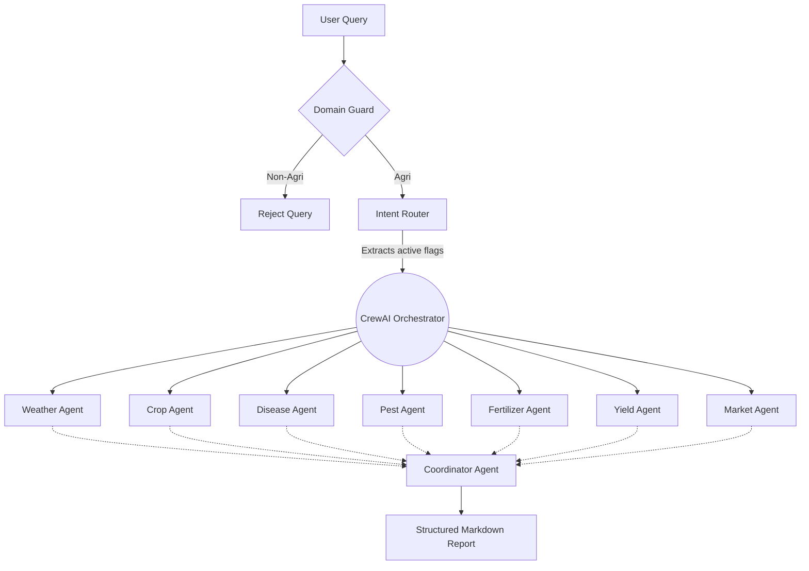

# Architecture — Raitha mitra v3.0

## Overview

Raitha mitra is a full-stack AI agriculture assistant powered by a CrewAI multi-agent orchestration system. It features a Flask backend, Groq SDK for ultra-fast LLM inference, Redis for session memory and live polling, and a modern glassmorphism frontend with bilingual (English/Kannada) support.

## Architecture Diagram

## Components

### 1. Frontend (`app/templates/` + `app/static/`)

| File | Purpose |
|------|---------|
| `templates/index.html` | Main template with AI Experts Status Panel |
| `static/css/style.css` | Glassmorphism UI, dynamic language swapping |
| `static/js/chat.js` | Chat logic, `/chat/status` polling, localized Voice APIs |

### 2. Backend (`app/routes/` and `app/services/`)

| Component | Responsibility |
|-----------|---------------|
| `chat.py` | Handles POST /chat, Domain Guard pre-processing, and delegates to AgriCrew. |
| `AgriCrew`| CrewAI orchestrator that builds tasks and executes sequential agents. |
| `Intent Router` | Fast Pydantic/LangChain extraction to bypass unnecessary agents. |
| `DomainGuard` | Strict pre-processing check to reject non-agricultural requests. |
| `MemoryService`| Redis conversation history + agent execution status for frontend polling. |

### 3. AI Models (Groq)

| Model | Use |
|-------|-----|
| `llama-3.3-70b-versatile` | CrewAI logic, Intent Routing, and Text generation |
| `llama-3.2-90b-vision-preview` | Image disease diagnosis |
| `whisper-large-v3-turbo` | Speech-to-text (STT) |

### 4. Live Agent Polling

Because CrewAI execution can take time, the backend pushes completed task agent roles into a Redis list scoped to the user's `session_id`.
The frontend polls `GET /chat/status` every second to display a live "AI Experts Working..." UI panel.

## Deployment

| Method | Config |
|--------|--------|
| Render | `render.yaml` + `requirements.txt` |
| Local  | `python run.py` |