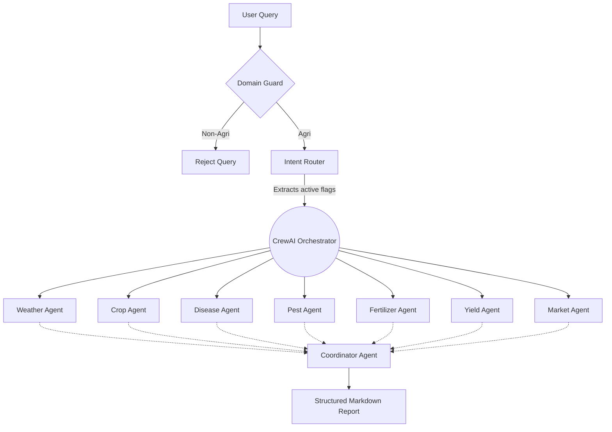

# Raitha mitra


Raitha mitra is an AI-powered agricultural advisory application designed to help farmers with crop advice, pest control, soil health, weather information, and government schemes. It supports voice, text, and image-based crop disease diagnosis using state-of-the-art Large Language Models and Vision models.

## 🌟 Key Features

- **Multi-Agent AI (CrewAI)**: Replaces a single LLM with a team of 8 specialized agents (Crop, Weather, Disease, Market, Pest, Fertilizer, Yield, and Coordinator) working sequentially to provide highly accurate, structured consultation reports.
- **Bilingual Support (English & Kannada)**: Full localization with dynamic language switching (🌐). The UI, AI responses, and Voice features automatically adapt between English and Kannada (ಕನ್ನಡ).
- **Strict Domain Guard**: A robust pre-processing layer ensures the assistant *strictly* rejects non-agricultural queries (medical, legal, financial, etc.).
- **Crop Disease Diagnosis**: Upload a photo of your crop, and Raitha mitra will analyze it using Vision models for diseases and pests.
- **Voice Input & Output**: Native Browser Speech Recognition (STT) and Speech Synthesis (TTS) for seamless hands-free interactions in both English and Kannada.
- **Weather Intelligence**: Live weather panels with Open-Meteo API integrations providing 7-day forecasting and smart farming advisory.
- **Live Status Polling**: An interactive "AI Experts Working..." UI panel that updates in real-time as the multi-agent crew executes tasks.
- **Chat History & Export**: Redis-backed conversation memory with the ability to download chat history as PDF.

## Architecture

Built with modern Python and JavaScript technologies:

- **Backend**: Flask (Python) with a clean service-oriented architecture.
- **Orchestration**: CrewAI for multi-agent workflows.
- **AI Integration**: LangChain, Groq API (LLaMA-3 70B, Vision Models).
- **Memory & State**: Redis (for chat history and SSE-like live polling status).
- **Frontend**: Vanilla HTML/CSS/JS with modern APIs (Web Speech API, marked.js), featuring a responsive, SaaS-style glassmorphism UI.

### System Flow


For detailed information, refer to [ARCHITECTURE.md](ARCHITECTURE.md).

## Installation

### Prerequisites

- Python 3.9+
- Redis Server (Running locally or hosted)
- Groq API Key

### Setup

1. **Clone the repository:**
   ```bash
   git clone https://github.com/HemanthD/raithamitra-assistant.git
   cd raithamitra-assistant
   ```

2. **Create a virtual environment:**
   ```bash
   python -m venv venv
   source venv/bin/activate  # On Windows: venv\Scripts\activate
   ```

3. **Install dependencies:**
   ```bash
   pip install -r requirements.txt
   ```

4. **Environment Variables:**
   Copy `.env.example` to `.env` and fill in your keys:
   ```bash
   cp .env.example .env
   ```

5. **Run the application:**
   ```bash
   python run.py
   ```

   The app will be available at `http://localhost:5000`.

## Environment Variables

See `.env.example` for a complete list of required environment variables. Key variables include:

- `GROQ_API_KEY`: Your Groq API Key.
- `REDIS_HOST`, `REDIS_PORT`: Your Redis configuration.
- `FLASK_SECRET_KEY`: A secure random string for Flask sessions.

## Deployment Guide

### Render

1. Create a new Web Service on Render.
2. Connect your GitHub repository.
3. Set the Environment to `Python`.
4. Set the Build Command to `pip install -r requirements.txt`.
5. Set the Start Command to `gunicorn -c gunicorn.conf.py run:app`.
6. Add your environment variables in the Render Dashboard.

## Screenshots

*(Add screenshots of the web interface here)*

## Contributing

We welcome contributions! Please see [CONTRIBUTING.md](CONTRIBUTING.md) for guidelines.

## License

This project is licensed under the MIT License - see the [LICENSE](LICENSE) file for details.

---

**Author:** Hemanth D  